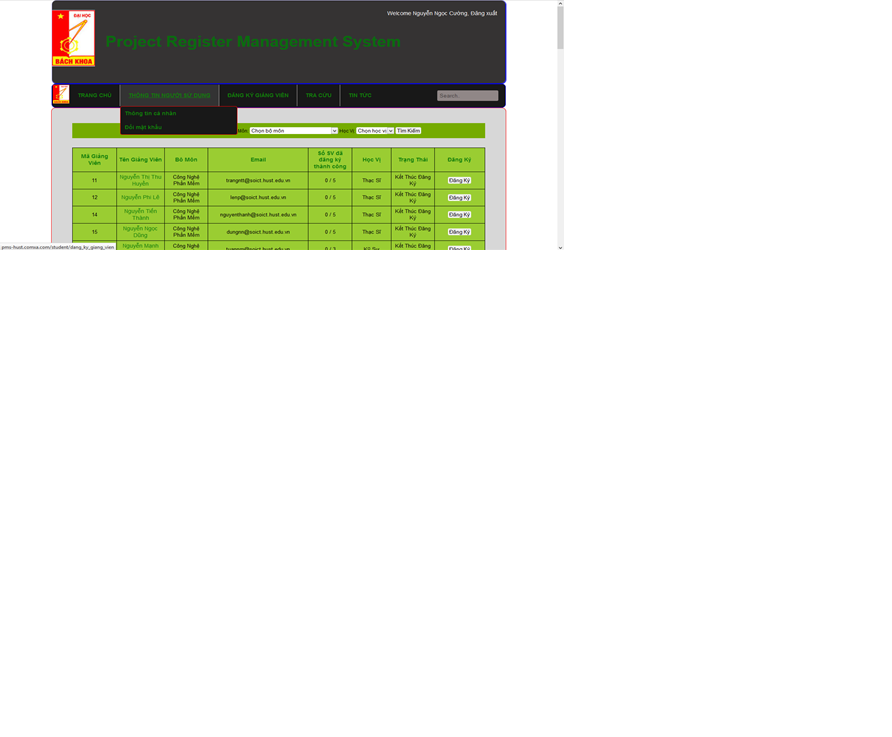

# Project-management-system
This project I built for one subject in my third year student. I built this from scrach using plain PHP, Javascript, HTML and CSS
This project followed MVC pattern, I have created a mini MVC framework for this project. It was quite basic but really interesting

